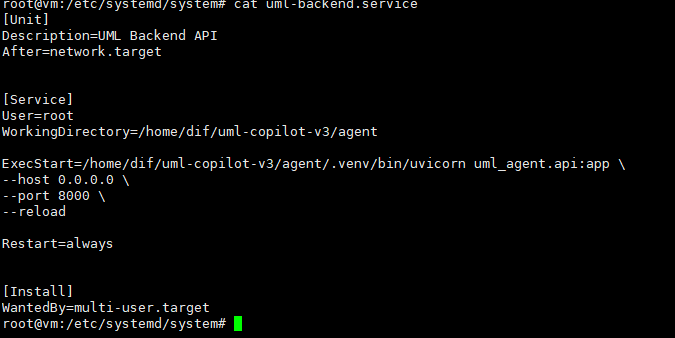
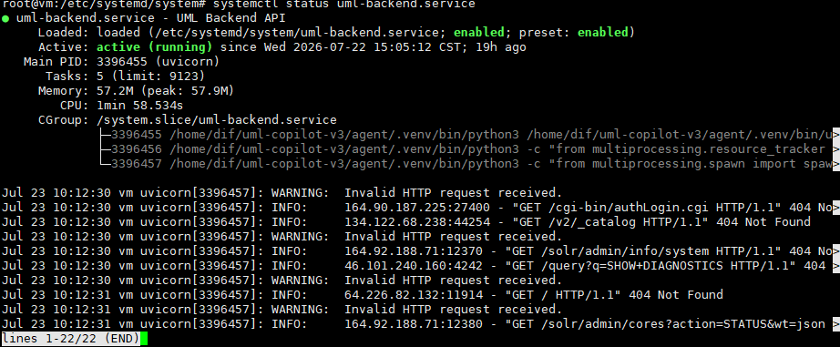
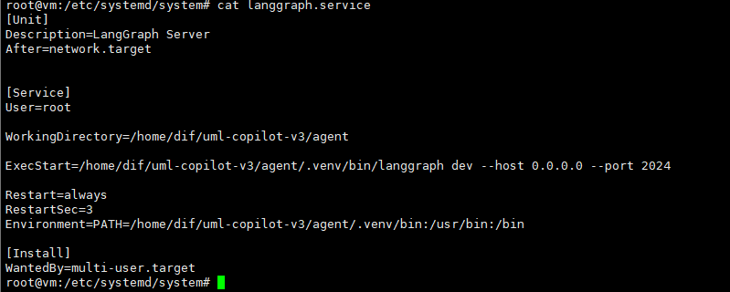
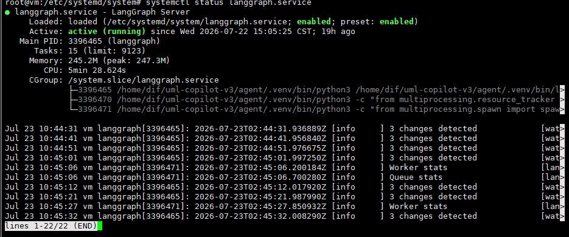
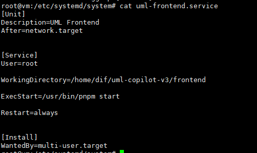
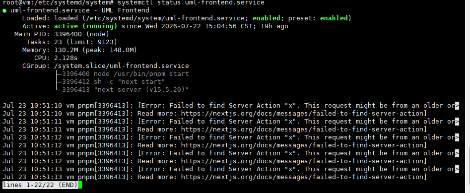
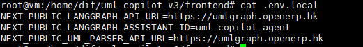

# UML Copilot v3

**UML Copilot v3** 是一个 AI 驱动的 **Excel-to-UML 数据建模工具**，同时也包含一个 **Odoo 原型设计助手**。
用户可以通过上传电子表格自动解析出数据模型，用自然语言对话修改模型，以及通过对话生成 Odoo 后台界面原型。

---

## 目录

- [本地启动指南](#启动指南)
- [服务器部署指南](#服务器部署指南)
- [使用示例](#使用示例)
- [问题日志](#问题日志)
- [待优化功能](#待优化功能)
---

## 启动指南

### 前置要求

- Python >= 3.11
- Node.js >= 18
- pnpm
- LLM API Key（测试使用 DeepSeek，也可配置 OpenAI 或其他兼容 API）

### 1. Parser 服务（端口 8000）

```bash
cd agent
python -m venv .venv
.venv\Scripts\activate     # Windows
source .venv/bin/activate  # Linux / macOS
pip install -e .
uvicorn uml_agent.api:app --reload --port 8000
```

### 2. LangGraph Agent 服务（端口 2024）

```bash
# 确保虚拟环境已激活
pip install langgraph-cli
pip install "langgraph-cli[inmem]"
langgraph dev
```

### 3. 前端（端口 3000）

```bash
cd frontend
pnpm install
cp .env.example .env.local
pnpm dev
```

打开 [http://localhost:3000](http://localhost:3000)。

### 环境变量配置

**agent/.env**（Parser / LangGraph 共享）：

```ini
OPENAI_API_KEY=sk-your-api-key
OPENAI_API_BASE=https://api.deepseek.com
OPENAI_MODEL=deepseek-chat

# 如需使用公司模型（当前暂未测试成功，建议用deepseek）：
# OPENAI_API_KEY=lm-studio
# OPENAI_API_BASE=https://odoollm.cpolar.top
# OPENAI_MODEL=qwen2.5-coder-7b-instruct

```

**frontend/.env.local**：

```ini
NEXT_PUBLIC_LANGGRAPH_API_URL=http://localhost:2024
NEXT_PUBLIC_LANGGRAPH_ASSISTANT_ID=uml_copilot_agent
NEXT_PUBLIC_UML_PARSER_API_URL=http://localhost:8000
```
---
## 服务器部署指南

### 前置要求

```bash
# Python 3.11+
sudo apt update && sudo apt install -y python3 python3-venv python3-pip nodejs npm git curl

# Node.js >= 18
curl -fsSL https://deb.nodesource.com/setup_20.x | sudo -E bash -
sudo apt install -y nodejs

# pnpm
npm install -g pnpm

```

### 项目传输与初始化

```bash
# 方式一：git clone （需配置SSH)
git clone git@github.com:dif460/uml-copilot-v3.git
cd uml-copilot-v3

# 方式二：scp 上传（已有压缩包）
压缩包地址：https://github.com/dif460/uml-copilot-v3.git
scp uml-copilot-v3.zip root@<服务器IP>:/root/
unzip uml-copilot-v3.zip && cd uml-copilot-v3
```

---

### 1. Parser 服务（端口 8000）

#### 创建 systemd 服务文件（生产环境常驻后台，测试时使用以下配置）

**`/etc/systemd/system/uml-backend.service`**

```ini
[Unit]
Description=UML Backend API
After=network.target

[Service]
Type=simple
User=root
WorkingDirectory=/root/uml-copilot-v3/agent
ExecStart=/root/uml-copilot-v3/agent/.venv/bin/uvicorn uml_agent.api:app --host 0.0.0.0 --port 8000
Restart=always
RestartSec=5
EnvironmentFile=/root/uml-copilot-v3/agent/.env

[Install]
WantedBy=multi-user.target
```
#### 创建虚拟环境并启动

```bash
cd /root/uml-copilot-v3/agent
python3 -m venv .venv
source .venv/bin/activate
pip install -e .

# 启用并启动服务
sudo systemctl daemon-reload
sudo systemctl enable uml-parser.service
sudo systemctl start uml-parser.service

# 检查状态
sudo systemctl status uml-parser.service
# 成功启动状态：

# 查看日志
sudo journalctl -u uml-parser.service -f
```

**测试**：
<!-- 测试时配置如图 -->

<!-- 成功启动状态 -->

<!-- 连通性测试 -->
```bash
curl http://localhost:8000/health
# 期望输出: {"status":"ok"}
```


### 2. LangGraph Agent 服务（端口 2024）

#### 创建 systemd 服务文件

**`/etc/systemd/system/uml-langgraph.service`**

```ini
[Unit]
Description=uml-langgraph Server
After=network.target

[Service]
Type=simple
User=root
WorkingDirectory=/root/uml-copilot-v3/agent
ExecStart=/root/uml-copilot-v3/agent/.venv/bin/langgraph dev --host 0.0.0.0 --port 2024
Restart=always
RestartSec=10
EnvironmentFile=/root/uml-copilot-v3/agent/.env

[Install]
WantedBy=multi-user.target
```

#### 启动

```bash
sudo systemctl daemon-reload
sudo systemctl enable uml-langgraph.service
sudo systemctl start uml-langgraph.service

# 检查状态
sudo systemctl status uml-langgraph.service

# 查看日志
sudo journalctl -u uml-langgraph.service -f
```

**测试**：
<!-- 测试配置如图 -->

<!-- 启动成功状态 -->

<!-- 连通性测试 -->
```bash
curl http://localhost:2024/ok
# 期望返回 OK 或类似健康响应
```
> 首次启动可能较慢（加载依赖和编译 graph），通过 `journalctl -u uml-langgraph.service -f` 观察进度即可。


### 3. 前端服务（端口 3000）

#### 创建 systemd 服务文件

**`/etc/systemd/system/uml-frontend.service`**

```ini
[Unit]
Description=UML Frontend
After=network.target

[Service]
Type=simple
User=root
WorkingDirectory=/root/uml-copilot-v3/frontend
ExecStart=/usr/bin/node /root/uml-copilot-v3/frontend/node_modules/.bin/next start -p 3000
Restart=always
RestartSec=5

[Install]
WantedBy=multi-user.target
```

#### 构建并启动

```bash
cd /root/uml-copilot-v3/frontend

# 配置环境变量
cp .env.example .env.local

# 编辑 .env.local，将 API 地址替换为实际服务器配置
#   NEXT_PUBLIC_LANGGRAPH_API_URL=https://域名
#   NEXT_PUBLIC_LANGGRAPH_ASSISTANT_ID=uml_copilot_agent
#   NEXT_PUBLIC_UML_PARSER_API_URL=https://域名
```

```bash
pnpm install
pnpm build

sudo systemctl daemon-reload
sudo systemctl enable uml-frontend.service
sudo systemctl start uml-frontend.service

# 检查状态
sudo systemctl status uml-frontend.service

# 查看日志
sudo journalctl -u uml-frontend.service -f
```
<!-- 测试时配置如图 -->
   
<!-- 启动成功状态 -->

<!-- 测试时环境配置如图 -->

<!-- 连通性测试 -->
```bash
curl http://localhost:3000/health
# 期望输出: {"status":"ok"}
```


---

### 4. nginx 反向代理（端口 80）(此代理应该是在反向代理服务器上配置，当前内部为长沙42服务器负责代理转发)

#### 创建 nginx 配置文件
<!-- 3000端口反向代理配置 -->
**`/etc/nginx/sites-enabled/uml`**

```nginx
server {
    listen 80;
    server_name uml.openerp.hk;
    return 301 https://$host$request_uri;
}

server {
    listen 443 ssl http2;
    server_name uml.openerp.hk;

    ssl_certificate     /etc/nginx/odoo18e_ai_ssl/openerp.hk.pem;
    ssl_certificate_key /etc/nginx/odoo18e_ai_ssl/openerp.hk.key;

    client_max_body_size 200M;

    location / {
        proxy_pass http://西南113服务器ip:3000;

        proxy_set_header Host $host;
        proxy_set_header X-Real-IP $remote_addr;
        proxy_set_header X-Forwarded-For $proxy_add_x_forwarded_for;
        proxy_set_header X-Forwarded-Proto https;
        proxy_hide_header Content-Security-Policy;
        proxy_hide_header X-Frame-Options;
    }
}

```
<!-- 测试时配置如图 -->


<!-- 2024端口反向代理配置 -->
**`/etc/nginx/sites-enabled/graphuml`**
```nginx
server {
    listen 80;
    server_name umlgraph.openerp.hk;
    return 301 https://$host$request_uri;
}

server {
    listen 443 ssl http2;
    server_name umlgraph.openerp.hk;

    ssl_certificate     /etc/nginx/odoo18e_ai_ssl/openerp.hk.pem;
    ssl_certificate_key /etc/nginx/odoo18e_ai_ssl/openerp.hk.key;

    client_max_body_size 200M;

    location / {
        proxy_pass http://西南地区113服务器ip:2024;

        proxy_set_header Host $host;
        proxy_set_header X-Real-IP $remote_addr;
        proxy_set_header X-Forwarded-For $proxy_add_x_forwarded_for;
	proxy_set_header X-Forwarded-Proto https;
        proxy_hide_header Content-Security-Policy;
        proxy_hide_header X-Frame-Options;
    }
}

```

#### 启用配置并重启

```bash
sudo ln -s /etc/nginx/sites-enabled/uml /etc/nginx/sites-enabled/
sudo ln -s /etc/nginx/sites-enabled/graphuml /etc/nginx/sites-enabled/
sudo nginx -t
sudo systemctl reload nginx
```


### 6. 验证部署

```bash
# 检查三个服务的 systemd 状态
sudo systemctl status uml-parser.service
sudo systemctl status uml-langgraph.service
sudo systemctl status uml-frontend.service
sudo systemctl status nginx #代理服务器长沙42

# 三个都显示 active (running) 即部署成功

# 查看实时日志
sudo journalctl -u uml-parser.service -f --no-pager
sudo journalctl -u uml-langgraph.service -f --no-pager
sudo journalctl -u uml-frontend.service -f --no-pager

# 通过浏览器访问
# http://<服务器IP>
# http://<服务器IP>:3000
```

---

### 日常运维

#### 重启单个服务

```bash
sudo systemctl restart uml-parser.service
sudo systemctl restart uml-langgraph.service
sudo systemctl restart uml-frontend.service
```

#### 查看日志

```bash
# 最近 50 行
sudo journalctl -u uml-parser.service -n 50 --no-pager

# 实时跟踪
sudo journalctl -u uml-parser.service -f

# 指定时间范围
sudo journalctl -u uml-parser.service --since "5 min ago"
```

#### 更新代码

```bash
cd /root/uml-copilot-v3
git pull

# 如有 Python 依赖变更
cd agent && source .venv/bin/activate && pip install -e . && cd ..

# 如有前端依赖变更
cd frontend && pnpm install && pnpm build && cd ..

# 依次重启三个服务
sudo systemctl restart uml-parser.service
sudo systemctl restart uml-langgraph.service
sudo systemctl restart uml-frontend.service
```

#### 停止服务

```bash
sudo systemctl stop uml-parser.service
sudo systemctl stop uml-langgraph.service
sudo systemctl stop uml-frontend.service

# 如需彻底禁用开机自启
sudo systemctl disable uml-parser.service
sudo systemctl disable uml-langgraph.service
sudo systemctl disable uml-frontend.service
```

## 使用示例

### UML 对话示例

导入 Excel 后，在聊天框输入：

- "Rename Customers to Accounts."
- "Add account_status as a non-null string field."
- "Link Orders.customer_id to Accounts.id as many-to-one."
- "Remove legacy_code from Products."
- "Create a new table called Categories with fields id and name."

### Odoo 原型对话示例

- "When amount exceeds 50,000, add two-level approval."
- "Add a Notes textarea field to the Sales Order form."
- "Add a business rule: only managers can approve orders over 20,000."

### 手动操作

- **添加表**：点击画布左上角 Add table 按钮
- **添加字段**：点击表节点上的 Add field
- **连线**：从一个表的右边缘拖拽到另一个表的左边缘
- **编辑**：点击表或关系线查看/修改属性面板
- **回滚**：底部版本历史面板点击历史版本
- **导出**：顶部工具栏 JSON / Mermaid 按钮

---

## 问题日志

### Parser 服务
1. **上传 CSV 文件解析失败**：编码问题。确保 CSV 为 UTF-8 编码，服务端使用 `utf-8-sig` 解码。
2. **字段类型推断为 unknown**：样本数据为空或全为空值。检查数据行是否包含有效值。
3. **测试服务启动失败**：检查对应端口是否被占用（2024，3000，8000）。

### LangGraph Agent
1. **前端提示 "Agent error"**：LangGraph 服务未运行或连接不上。检查 `systemctl status uml-langgraph.service`，确认端口 2024 可访问。
2. **编辑 Python 文件后启动报 SyntaxError**：PowerShell `Set-Content` 默认非 UTF-8，Unicode 字符被损坏。使用 Python `open(encoding='utf-8')` 或 `[System.IO.File]::WriteAllLines` 写入，避免 `Set-Content`。
3. **首次启动极慢**：langgraph dev 编译 graph 需要 30 秒以上。通过 `journalctl -u uml-langgraph.service -f` 观察进度，等待即可。
4. **外部网络无法访问 LangGraph**：`langgraph dev` 默认绑定 `127.0.0.1`，仅限本机访问。启动时加 `--host 0.0.0.0`，或通过 nginx 反向代理转发。
5. **Odoo Agent 对话报错或无响应**：前端 `.env.local` 中的 `ASSISTANT_ID` 与 `langgraph.json` 注册的 graph 名称不匹配。确认 `NEXT_PUBLIC_LANGGRAPH_ASSISTANT_ID=odoo_requirement_agent` 与 `langgraph.json` 中的 key 一致。
6. **页面报错跨域问题**：langgraph 仅支持 http 协议，反代域名时采取的 https 请求。确认 `.env.local` 地址填写无误或修改代理服务器的 nginx 配置。
7. **公司内部大模型接入问题**：由于openai接口限制，公司内部大模型无法直接调用，需修改模型调用接口函数，目前正在调式。
8. **多用户测试失败**：由于电脑性能不足导致测试失败。

### 前端
1. **前端页面访问缓慢**：使用了 `pnpm dev`（仅开发模式）而非生产构建。执行 `pnpm build && pnpm start`。
2. **API 请求返回 404**：后端端口不对。检查 `.env.local` 中的地址是否正确。
3. **构建后报 Server Action 错误**：`.next` 构建缓存来自不同平台（如 Windows 构建后传到 Linux 运行）。删除 `.next` 目录，在目标服务器上重新执行 `pnpm build`。
4. **favicon 返回 404（无害）**：项目缺少 `public/favicon.ico` 文件，浏览器自动请求导致。可忽略，不影响功能；或在 `public/` 下添加 favicon。
5. **修改 `.env.local` 后不生效**：`NEXT_PUBLIC_*` 变量在 `pnpm build` 时内联，仅修改文件不重新构建无效。修改后必须重新执行 `pnpm build && pnpm start`。
6. **uml生成失败**：检查excel表是否符合需求，多个表需采取子表的形式进行录入，每个子表对应一个uml图。可参考[excel示例1](test/在线教育测试数据表中文版.xlsx)、[excel示例2](test/odoo_requirement_agent.xlsx)。

### 服务器部署
1. **systemctl start 后服务立即退出（inactive）**：ExecStart 路径错误或虚拟环境未激活。使用绝对路径指向 `.venv/bin/` 下的可执行文件，确认 `pip install -e .` 完成。
2. **上传大 Excel 文件超时**：nginx `client_max_body_size` 未设置（默认 1MB）。在 nginx 配置中添加 `client_max_body_size 200m;`。
3. **端口 80 无法访问**：运营商封锁（中国云服务器需 ICP 备案）或安全组未放行。改用其他端口（如 8080），或配置 HTTPS（443 端口）。
4. **LangGraph 服务外部无法访问**：`langgraph dev` 默认监听 `127.0.0.1`。启动时加 `--host 0.0.0.0` 参数，或在 nginx 中反向代理到本机 2024 端口。
5. **pkill 后进程仍有残留**：父进程（shell session）未被杀死。逐个 `pkill -f "uvicorn uml_agent"` 确认清除，再用 `ss -tlnp` 验证。
6. **服务器配置换源**：部署时确认服务器已换源，避免加载缓慢。

---

## 待优化功能
1. **优化公司内部模型调用接口**：当前无法调用公司内部模型，暂时仅支持调用openai模型或其兼容模型如deepseek模型，需要优化。
2. **uml表数据流通**：当前仅支持table间的对应关系，缺少字段间的数据计算功能。
3. **聊天模型操作uml图**：当前对uml增删时有断触现象，模型能正常答复，但不进行实际操作。
4. **模型增加table表间关系**：关系正确性有待验证。
